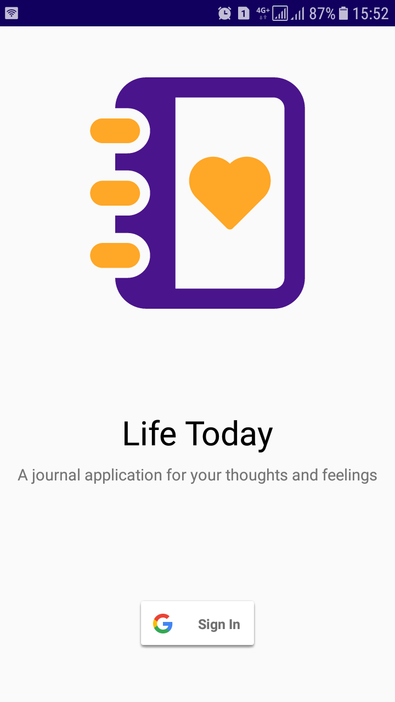
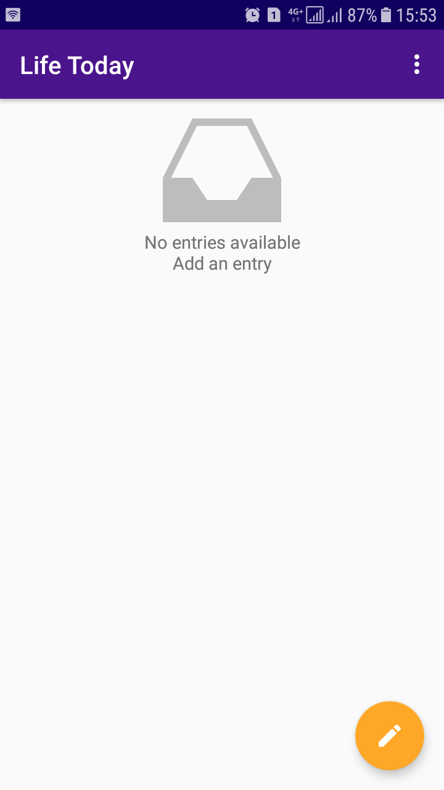
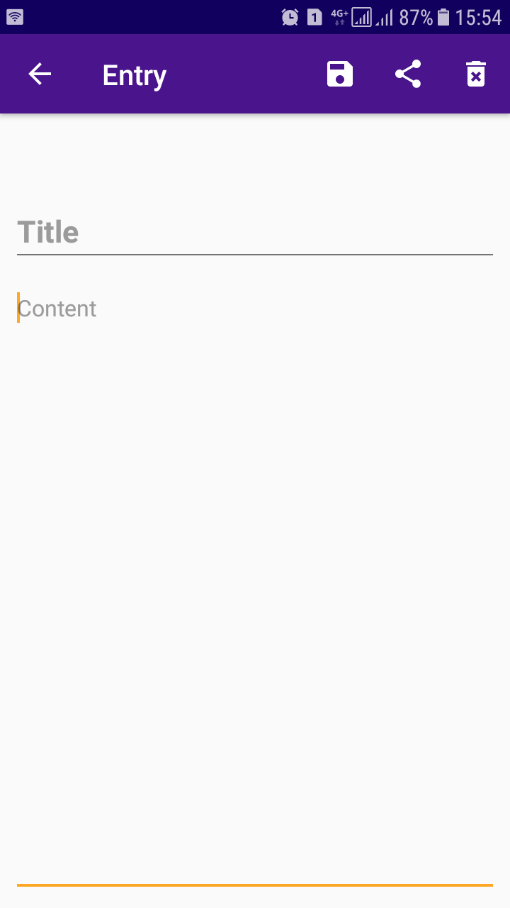
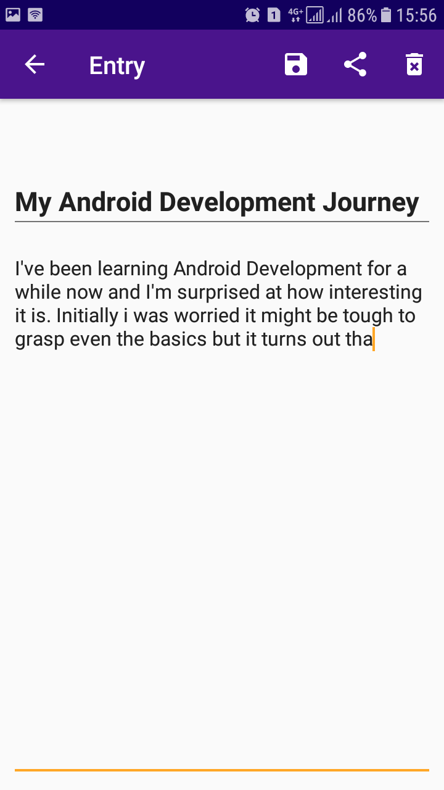
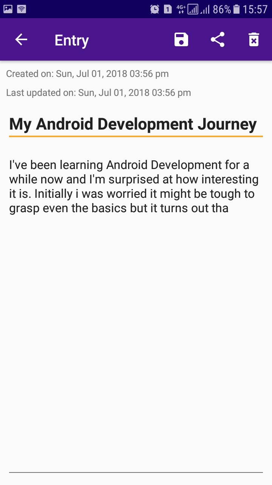

# Life Today Android Journal App

A journal application where in users can pen down their thoughts and
feelings

 





## Getting Started

To run this project, do the following:

1. Clone the project
2. Open the project from `Android Studio`

Get the latest APK release [here](https://github.com/EddyMM/life-today-journal-app/releases)

### Prerequisites

- Android Studio IDE
- Gradle


### Installing

- Clone the project

```
git clone https://github.com/EddyMM/life-today-journal-app.git
```

- Open project using `Android Studio`
- Sync with gradle files to get the necessary dependencies
- Run the project using emulator or connected Android Device


## Running the tests

- From Android Studio Edit `Run Configurations` and add an Instrumented Test for the `app` module
- Once Tests have loaded, Click on `Run`

## Built With

- Android SDK
- Gradle - Dependency Management
- FirebaseAuth - User Authentication
- FirebaseDatabase - Data persistence

## Contributing

Please read [CONTRIBUTING.md](https://gist.github.com/PurpleBooth/b24679402957c63ec426) for details on our code of conduct, and the process for submitting pull requests to us.

## Versioning

We use [SemVer](http://semver.org/) for versioning. For the versions available, see the [tags on this repository](https://github.com/your/project/tags).

## Authors

* **Eddy Mwenda Mwiti**  - [EddyMM](https://github.com/EddyMM)

## License

This project is licensed under the MIT License - see the [LICENSE.md](LICENSE.md) file for details
